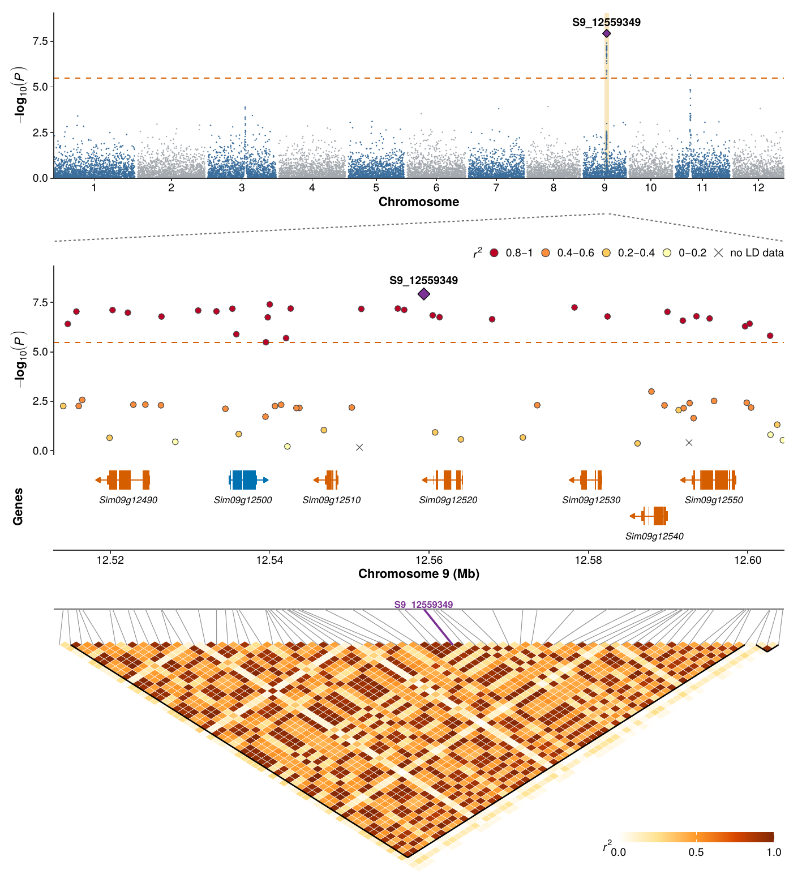

# quardplot

Figures and tables for a GWAS locus, made with R.

From your GWAS results, gene annotation (GFF3) and genotypes (VCF or HapMap),
`quardplot` makes:

* **a PDF figure** with up to four panels on one aligned genomic axis: the
  genome-wide Manhattan plot, a zoom on the locus coloured by linkage
  disequilibrium (LD) with the lead SNP, the genes of the region and the LD
  heatmap;
* **tables** (CSV files, or one Excel file): the genes of the region; every
  SNP of the region with its P value, LD with the lead SNP, closest gene and
  whether it lies in an exon, intron, promoter, downstream region or between
  genes; and the LD between every pair of SNPs;
* **extra tools**: gene lists for any region, single-gene structure plots,
  HapMap to VCF conversion, chromosome maps of SNP and indel density, and
  phylogenetic trees of the individuals with their names.

LD (r2, D') and LD blocks are calculated inside R, with the same definitions
as PLINK 1.9, so PLINK is not needed.

This is version 2.0.0, the first release as an R package; `NEWS.md` lists the
changes since the original script (version 1.0.0).

## Install

1. Install R (version 4.1 or newer) and, once, the packages quardplot needs:

   ```r
   install.packages(c("data.table", "ggplot2", "patchwork"))
   install.packages("writexl")   # optional: Excel (.xlsx) tables
   install.packages("ape")       # optional: faster trees for more than 400 samples
   ```

2. Install quardplot, either directly from GitHub:

   ```r
   install.packages("remotes")
   remotes::install_github("sujee119/quard_plot")
   ```

   or from the release file `quardplot_2.0.0.tar.gz` (no compiler or Rtools
   needed, also on Windows and macOS):

   ```r
   install.packages("quardplot_2.0.0.tar.gz", repos = NULL, type = "source")
   ```

   Give the full path if the file is not in your working directory, e.g.
   `install.packages("C:/Users/me/Downloads/quardplot_2.0.0.tar.gz", repos = NULL, type = "source")`.

## Start

```r
library(quardplot)
quard_guide()                 # copies the step-by-step guide into your folder and opens it

set_species("rice")           # 1. choose the species: rice, arabidopsis, tomato, human, mouse

# 2. practice data with the same file structure as real data
ex <- simulate_example_data("practice_data")
#    example_gwas.csv, example_genes.gff3, example_region.vcf.gz, example_complete.hmp.txt, ...

check_inputs(list(gwas = ex$gwas, gff = ex$gff, vcf = ex$vcf))     # 3. check the files

res <- quard_plot(ex$gwas, ex$gff, ex$vcf, chr = ex$chr, pos = ex$pos,   # 4. figure + tables
                  output = "results/locus.pdf")
```



The figure above is the PDF made by these lines (shown here as an image). The
region is the LD block that contains the SNP of interest; SNPs are coloured by
their r2 with that SNP, and crosses mark SNPs without genotype data. The same
call wrote `locus_genes.txt`, `locus_SNPs.csv` (every SNP with its P value, r2
and location relative to the nearest gene), `locus_LD_r2.csv` and a README
describing the files.

With your own files, replace `ex$gwas`, `ex$gff` and `ex$vcf` by your file
names, e.g. `quard_plot("my_gwas.csv", "genes.gff3", "genotypes.vcf.gz",
target = "top", output = "results/locus.pdf")`. All files must use the same
reference genome version, and the genotypes should come from the individuals
of the GWAS; `check_inputs()` tells you when they do not seem to.

The guide (`quard_guide()`) explains, in plain language, what each input file
must look like and every function of the package; the vignette
(`vignette("quardplot")`) shows the main steps. Help for any function:
`?quard_plot`, `?set_species`, `?check_inputs`, ...

## From a terminal

```
Rscript -e "quardplot::quard_cli()" --help
Rscript -e "quardplot::quard_cli()" --species rice --gwas gwas.csv --gff genes.gff3 \
        --vcf genotypes.vcf --target top --out results/locus.pdf --table-format xlsx
```

## Citation

If you use quardplot, please cite: Rajendran S, Lee S-J, Kim CM. quardplot: an
R package for aligned GWAS locus plots with linkage disequilibrium calculated
from local genotype data (submitted).

## Licence

MIT
